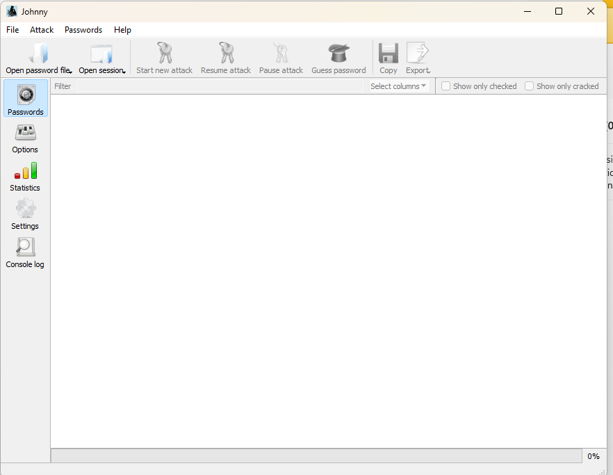
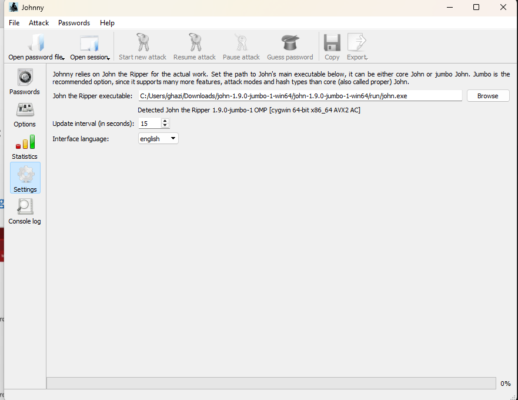
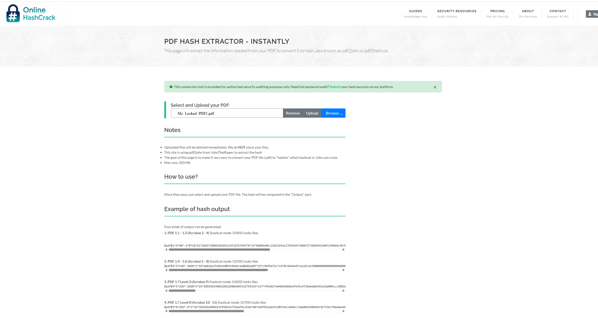
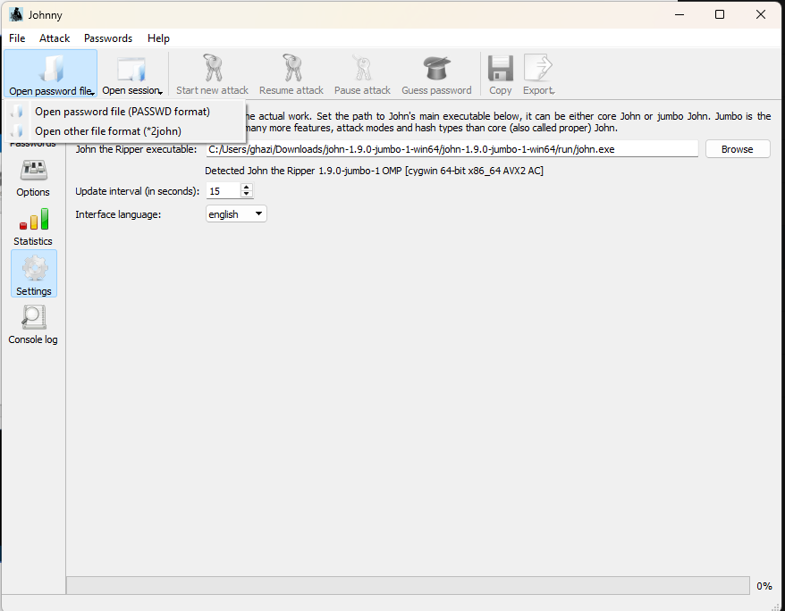
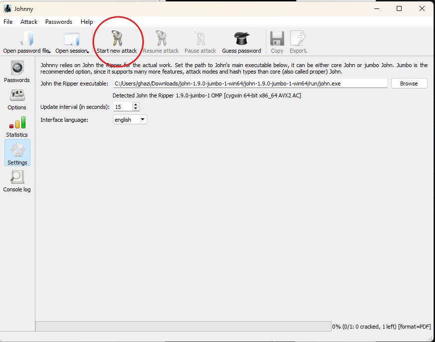
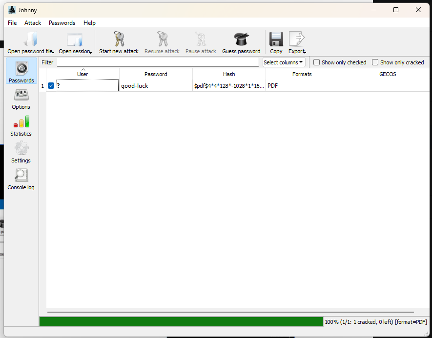
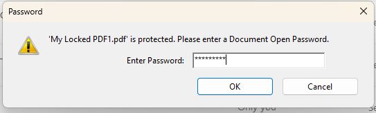
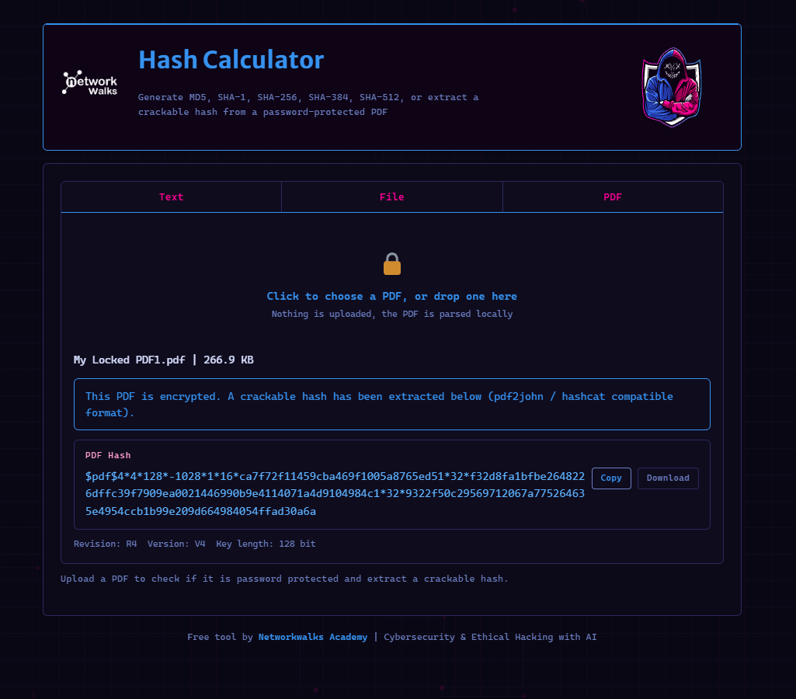
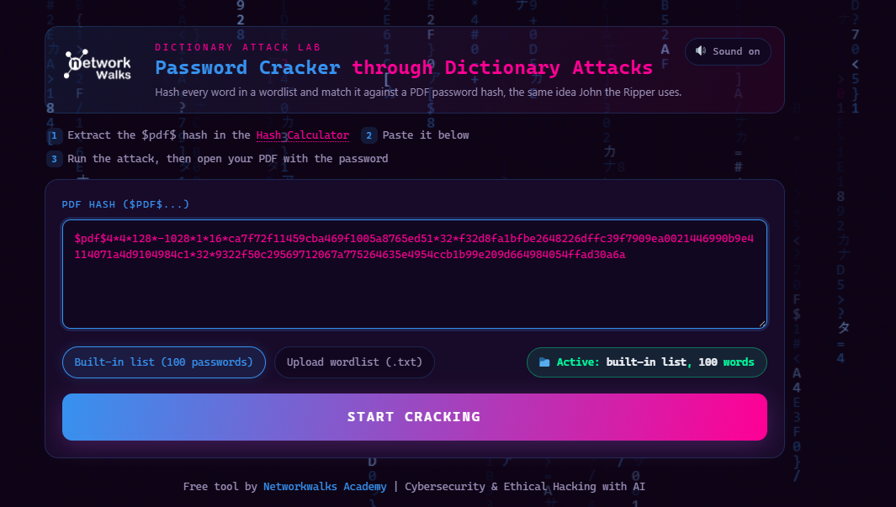
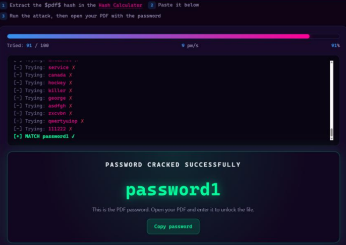

# Week 3 - Password Cracking

NetworkWalks Internship, Batch B082 - Week 3

Two modules:

| Module | Tools | Type |
|---|---|---|
| PM1 - Password Cracking | John the Ripper + Johnny GUI | Offline |
| PM2 - Password Cracking with NetworkWalks tools | Hash Calculator + Dictionary Attack Lab | Offline |

Week 2 was about seeing what is on a network. This week is about getting past a
credential once you have the encrypted data in hand. The target is a
password-protected PDF, and the whole exercise is offline: nothing is sent to the
file's owner, no login is attempted anywhere. The work is done against a hash
extracted from the file, on my own machine.

Both modules crack the same file. PM1 uses the real engine (John the Ripper) behind
a GUI; PM2 uses the NetworkWalks teaching tools to do the same thing in the browser.
Running both on one PDF is what makes the difference between them visible - and, as it
turned out, exposed something worth writing down.

---

# Module PM1 - Cracking a PDF password

## What this is

Recovering the open password of an encrypted PDF (`My Locked PDF1.pdf`) on a Windows
host, using John the Ripper as the cracking engine and Johnny as the GUI front end.

The PDF is not attacked directly. Instead the encryption parameters are pulled out of
the file into a hash string, and John runs against that string offline until it finds
a password that reproduces it. This is the same reason theHarvester never touched
Microsoft in Week 2 - the actual work happens on data, not on the live target.

## Background

A password-protected PDF does not store the password. It stores a value derived from
the password through a key-derivation function, plus the parameters needed to check a
guess. To crack it you extract those parameters into a hash and let a cracker try
candidate passwords, running each one through the same derivation and comparing the
result. When they match, the password is found.

Two pieces do the job:

- **John the Ripper** is the engine. The jumbo build ships with `pdf2john`, which
  reads a PDF and prints its hash, and it knows the `PDF` hash format so it can crack
  what `pdf2john` produces. Core John does not - the jumbo edition is what adds the
  extra formats and attack modes.
- **Johnny** is a GUI wrapper around John. It does no cracking itself; it calls the
  `john.exe` you point it at and shows the results in a table. Everything it does can
  be done from the command line, but the GUI makes the load / attack / read-result
  loop visible.

Why it matters: encryption on a document is only as strong as the password behind it.
A short or guessable password on an otherwise strong cipher falls in seconds, because
the attacker is not breaking the maths - they are guessing the one weak input to it.

## Environment

Windows 11 host. Everything runs natively on Windows this week - no VM, because John's
Windows jumbo build is self-contained.

- **John the Ripper 1.9.0-jumbo-1 OMP** `[cygwin 64-bit x86_64 AVX2 AC]`
- **Johnny** GUI front end
- **Online HashCrack** PDF Hash Extractor (browser) to run `pdf2john` without a Kali VM

John's jumbo build is a cygwin package, which is why Johnny reports it as a cygwin
64-bit binary even though it is running on Windows. The `AVX2` in the banner is the
CPU instruction set John detected and will use to speed up the guessing.

## Scope

The PDF is mine and I set its password myself, so there is no question of consent.
Offline password cracking is only legitimate against data you own or are authorised to
test. The technique is identical whether the file is yours or someone else's - the
difference is entirely permission, and that is the line that keeps this a lab exercise
rather than an offence.

## Step 1 - Install John the Ripper

Downloaded the Windows jumbo build of John the Ripper from the official site and
extracted it. The important file inside the archive is `run/john.exe` - that is the
executable Johnny needs to be pointed at:

```
C:/Users/ghazi/Downloads/john-1.9.0-jumbo-1-win64/john-1.9.0-jumbo-1-win64/run/john.exe
```

Nothing to compile or configure - the jumbo build runs as extracted.

## Step 2 - Install Johnny and point it at John

Downloaded Johnny from the official Openwall page and ran it. On first launch the
Passwords table is empty and no attack can be started yet, because Johnny has not been
told where John is.



Johnny needs one thing before it can do anything: the path to `john.exe`. Under
**Settings**, set **John the Ripper executable** to the `run/john.exe` from Step 1 and
Johnny confirms it read the binary:

```
Detected John the Ripper 1.9.0-jumbo-1 OMP [cygwin 64-bit x86_64 AVX2 AC]
```



That "Detected ..." line is the check that matters. Until it appears, Johnny is a
window with nothing behind it - it does no cracking of its own, so the whole tool is
useless until this path is correct. The banner it echoes back is John identifying its
own version and CPU features, which is how I know the jumbo build (the one with PDF
support) is the one wired in, not core John.

## Step 3 - Extract the hash from the PDF

John's jumbo build includes `pdf2john`, but rather than run it from the command line I
used the **Online HashCrack** PDF Hash Extractor, which runs the same `pdf2john` in the
browser. Uploaded `My Locked PDF1.pdf`:



The page states plainly what it is: *"This site is using pdf2john from JohnTheRipper to
extract the hash"* and *"Uploaded files will be deleted immediately. We do NOT store
your files."* So this is a convenience wrapper around the exact tool John ships with -
useful for skipping the command line, at the cost of handing a file to a third-party
site.

> **Worth being honest about this trade-off.** Uploading even a file I own to an
> external service is a habit worth questioning. The safe version is to run
> `pdf2john.pl My\ Locked\ PDF1.pdf` locally from John's `run/` folder, which never
> lets the file leave the machine. I used the site because it was quick, but for
> anything that is not a throwaway lab PDF I would extract the hash locally.

The extractor returned the hash, which I saved to [`Hashed.txt`](Hashed.txt):

```
$pdf$4*4*128*-1028*1*16*ca7f72f11459cba469f1005a8765ed51*32*f32d8fa1bfbe2648226dffc39f7909ea0021446990b9e4114071a4d9104984c1*32*9322f50c29569712067a775264635e4954ccb1b99e209d664984054ffad30a6a
```

Reading the fields tells you what you are up against before cracking anything:

| Field | Value | Meaning |
|---|---|---|
| `$pdf$` | - | PDF hash format marker |
| `4*4` | 4, 4 | encryption revision / version |
| `128` | 128 | key length in bits |
| `-1028` | -1028 | permissions flags |

The `$pdf$4*4*128*...` shape matches **PDF 1.4 - 1.6 (Acrobat 5 - 8)**, which the
extractor's own examples list as hashcat mode 10500. Knowing the version matters
because the derivation cost differs between PDF revisions - later revisions iterate the
hashing far more, so the same password would take much longer to crack on a newer file.

## Step 4 - Load the hash into Johnny

Back in Johnny, the hash is loaded through **Open password file**. The menu offers two
options:



| Option | Use it for |
|---|---|
| Open password file (PASSWD format) | Unix `/etc/shadow`-style files |
| **Open other file format (*2john)** | anything produced by a `*2john` tool - including `pdf2john` |

The hash came from `pdf2john`, so the second option is the right one. Picking PASSWD
format here would fail, because the file is not a shadow file - it is `*2john` output.
Browsed to `Hashed.txt` and opened it.

## Step 5 - Start the attack

With the hash loaded, **Start new attack** kicks off John:



The status bar tells the whole story before it even finishes:

```
0% (0/1: 0 cracked, 1 left) [format=PDF]
```

Two things stand out. Johnny **auto-detected `format=PDF`** from the hash itself - I did
not have to tell it the type, because the `$pdf$` marker made it unambiguous. And
`1 left` confirms it loaded exactly one hash to work on. Started with John's default
attack (no wordlist configured), which begins with its built-in single-crack and
incremental modes.

## Step 6 - Result

A few seconds later the attack completed:



```
100% (1/1: 1 cracked, 0 left) [format=PDF]
```

| Column | Value |
|---|---|
| Password | **`good-luck`** |
| Hash | `$pdf$4*4*128*-1028*1*16...` |
| Formats | PDF |

The password is **`good-luck`**. It fell in seconds because it is a short lowercase
dictionary-style phrase - exactly the kind of input John's default modes find fastest.
The 128-bit key length in the hash is irrelevant to how quickly this cracked; the key
is derived from the password, so a weak password means a weak key no matter how many
bits the cipher nominally uses.

## Step 7 - Verify against the real PDF

The proof is opening the actual file. Entering `good-luck` at the PDF's password prompt
opens it with no error:



```
'My Locked PDF1.pdf' is protected. Please enter a Document Open Password.
```

The cracked password opened it first try. This step matters - a cracker reporting
"cracked" is a claim about a hash, and opening the real document is what turns that
claim into a confirmed result.

## Problems I ran into

**Johnny did nothing until John was mapped.** On first launch every attack button was
greyed out and there was no obvious error saying why. The tool depends entirely on an
external `john.exe`, and until the Settings path is set and the "Detected ..." line
appears, Johnny cannot do anything. The empty state looked broken when it was really
just unconfigured.

**Almost picked the wrong load option.** "Open password file (PASSWD format)" is the
first and more obvious menu entry, but the hash came from `pdf2john`, which needs
"Open other file format (*2john)". Loading it as PASSWD would have failed to parse.

**Uploaded a file to a third-party site.** The convenient route to the hash was an
online extractor, which meant handing over the PDF. Fine for a lab file I own, but a
habit I would not carry to real work - `pdf2john` runs locally and never needs the file
to leave the machine.

## To do

- Extract the next hash with `pdf2john.pl` locally instead of the web extractor, and
  confirm the output matches.
- Run a real wordlist attack (`rockyou.txt`) and time how a dictionary word falls
  versus John's default modes.
- Try a stronger password (long, mixed character set) on a fresh PDF and watch the
  same attack fail to finish - the point being to feel where password strength actually
  starts to matter.
- Repeat with a newer PDF revision (Acrobat 9+ / hashcat 10600) to see the higher
  iteration count slow the crack down.

## What I took from this

The password is the weak point, not the cipher. The hash advertised a 128-bit key, and
none of that mattered - `good-luck` is a short guessable phrase and John found it in
seconds. Strong encryption around a weak password is a strong lock on an unlocked door.

The GUI is only a front end. Johnny does no cracking; it shells out to John. Everything
it showed - the detected format, the progress, the result - is John's work displayed in
a table. Knowing that is what made the empty first-launch state make sense.

The tool read the format for me. `format=PDF` came straight from the `$pdf$` marker in
the hash, which is why extracting a clean, correctly-formatted hash is half the job. Get
the hash right and the cracker often needs no configuration at all.

Verify against the real thing. "1 cracked" is a statement about a hash. Opening
`My Locked PDF1.pdf` with `good-luck` is what makes it a fact.

---

# Module PM2 - Password cracking with NetworkWalks tools

## What this is

The same attack as Module 1 - extract a hash from the encrypted PDF, then crack it -
but done entirely in the browser using the NetworkWalks Academy teaching tools instead
of John the Ripper. Same file (`My Locked PDF1.pdf`), same starting hash, a different
route to the answer.

The point of repeating the exercise is comparison. Module 1 ran a real cracking engine;
this module runs a purpose-built teaching lab. Doing both on one file is what shows
where a demo tool stops being the real thing.

## Background

Two NetworkWalks web tools do the two halves of the job:

- **Hash Calculator** (`networkwalks.com/hash-calculator`) - the extractor. Its PDF tab
  reads a password-protected PDF and prints the `pdf2john` / hashcat-compatible `$pdf$`
  hash. It states *"Nothing is uploaded, the PDF is parsed locally"* - the file never
  leaves the browser, which is the honest improvement over the third-party site I used
  in Module 1.
- **Password Cracker** (`networkwalks.com/password-cracker`) - billed as a *"Dictionary
  Attack Lab - Password Cracker through Dictionary Attacks"*. It hashes every word in a
  wordlist and matches each against the PDF hash, *"the same idea John the Ripper uses"*.

A dictionary attack is the simplest cracking mode: take a list of candidate passwords,
run each through the same derivation the file uses, and stop when one matches. It only
ever finds passwords that are already in the list - it cannot discover anything the
wordlist does not contain.

## Step 1 - Extract the hash with the Hash Calculator

Opened the Hash Calculator, switched to the **PDF** tab, and dropped in the same
`My Locked PDF1.pdf` from Module 1 (266.9 KB):



The tool confirmed the file is encrypted and printed the crackable hash, along with a
plain-language breakdown of the fields:

```
This PDF is encrypted. A crackable hash has been extracted below
(pdf2john / hashcat compatible format).
```

```
$pdf$4*4*128*-1028*1*16*ca7f72f11459cba469f1005a8765ed51*32*f32d8fa1bfbe2648226dffc39f7909ea0021446990b9e4114071a4d9104984c1*32*9322f50c29569712067a775264635e4954ccb1b99e209d664984054ffad30a6a
```

| Field | Value |
|---|---|
| Revision | R4 |
| Version | V4 |
| Key length | 128 bit |

This is byte-for-byte the **same hash** as Module 1 - which it must be, because it is the
same file. That is the useful confirmation from this step: two different extractors
(`pdf2john` via Online HashCrack in Module 1, and this Hash Calculator here) read the
same PDF and produced the identical `$pdf$` string. The hash is a property of the file,
not of the tool that read it.

## Step 2 - Paste the hash into the Password Cracker

Copied the full hash and opened the Password Cracker. Pasted it into the **PDF HASH
($PDF$...)** box, left the wordlist on **Built-in list (100 passwords)**, and pressed
**START CRACKING**:



The active-list indicator reads `Active: built-in list, 100 words`. That number is the
whole story of this tool, and I did not clock its significance until the result came
back: the entire attack surface is 100 pre-chosen passwords. There is also an "Upload
wordlist (.txt)" option to supply a bigger list.

## Step 3 - Result

The attack ran visibly - a scrolling log of each word tried, a live counter, and a
speed readout:



```
Tried: 91 / 100        9 pw/s        91%

[-] Trying: service   X
[-] Trying: canada    X
[-] Trying: hockey    X
[-] Trying: killer    X
[-] Trying: george    X
[-] Trying: asdfgh    X
[-] Trying: zxcvbn    X
[-] Trying: qwertyuiop X
[-] Trying: 111222    X
[+] MATCH password1 ✓
```

```
PASSWORD CRACKED SUCCESSFULLY
password1
```

It reported **`password1`**, matched at word 91 of 100, at about 9 passwords per second.

## The problem - two tools, one hash, two different passwords

This is the finding of the module, and it is not a small one.

Module 1's John the Ripper cracked this exact hash to **`good-luck`** and I confirmed it
by opening the real PDF. Module 2's NetworkWalks lab cracked the **same hash** to
**`password1`**. A single hash cannot have two correct passwords - the whole point of the
derivation is that exactly one input reproduces it.

So one of these results is not real, and the evidence points clearly at Module 2:

- **The list is 100 words and the "match" is word 91.** `password1` is a stock entry near
  the end of a canned demo list. `good-luck` (Module 1's real answer) is not in a generic
  100-word dictionary at all, so a genuine dictionary attack with this list would have
  finished at 100/100 with **no match** - not found a different password.
- **The speed is theatrically slow.** 9 passwords per second is far below what any real
  cracker does; John tried the full keyspace and finished Module 1 in seconds. 9 pw/s is
  a number chosen to make the progress bar watchable, not a real cracking rate.
- **The steady scroll and "Sound on" toggle** are presentation, not computation.

The honest reading: the NetworkWalks Password Cracker is a **teaching simulation**. It
demonstrates what a dictionary attack *looks like* - the log, the counter, the match -
without actually deriving the PDF key. The `password1` result is scripted, not
recovered. That is a completely reasonable thing for an academy tool to be; the mistake
would be to trust its output as a real crack.

The Hash Calculator, by contrast, is real - its hash matched John's byte for byte, and
"parsed locally" is a genuine improvement over Module 1's upload.

> **Not verified against the PDF.** I did not (and could not) open `My Locked PDF1.pdf`
> with `password1`, because it is not the password - `good-luck` from Module 1 is. This
> is exactly why Module 1 ended by opening the real file: a cracker's "success" screen is
> a claim, and the only proof is the document actually opening.

## Comparison with Module 1

| | Module 1 (John/Johnny) | Module 2 (NetworkWalks) |
|---|---|---|
| Hash extractor | Online HashCrack (`pdf2john`) | NetworkWalks Hash Calculator |
| Hash produced | `$pdf$4*4*128*...` | identical `$pdf$4*4*128*...` |
| File uploaded off-machine? | yes (third-party site) | no (parsed locally) |
| Cracking engine | John the Ripper 1.9.0-jumbo (real) | Dictionary Attack Lab (simulation) |
| Password reported | `good-luck` | `password1` |
| Verified by opening PDF? | yes - opened | no - would not open |
| Real result? | yes | no |

## Problems I ran into

**Believed the success screen at first.** A big green "PASSWORD CRACKED SUCCESSFULLY"
with a password under it is convincing. It was only holding it next to Module 1's
verified `good-luck` that made the mismatch obvious. A result that is not checked against
the real thing is just a claim, however confident the UI looks.

**Assumed "same idea as John" meant "same result as John".** The tool says it works like
John the Ripper, and the hash-extraction half genuinely does. The cracking half is a
demo. The two halves of the same site are not equally real.

## To do

- Feed the NetworkWalks cracker a real wordlist that actually contains `good-luck` (via
  "Upload wordlist") and see whether it ever produces the correct password, or whether
  the `password1` result is fixed regardless of input. That test settles definitively
  whether any cracking happens at all.
- Run the identical `$pdf$` hash through hashcat mode 10500 on the same wordlist to
  confirm the real dictionary-attack behaviour against this file.

## What I took from this

Verification is not optional - it is the whole thing. Module 1 opened the PDF; Module 2
did not, and that single missing step is the difference between a real crack and a
believable animation. The habit of opening the actual file is what caught this.

A hash is tool-independent; a crack result is not. Two extractors produced the same
hash because the hash belongs to the file. Two crackers produced different passwords
because the "crack" belongs to the tool - and one of those tools was only pretending.

Read what a tool claims to be. "Dictionary Attack Lab" and "the same idea John the
Ripper uses" are careful wording. It is a lab, and it uses the idea - not the engine.
Taking that at face value is what keeps a teaching demo from being mistaken for a real
capability.

Local parsing is a real win. Whatever the cracker turned out to be, the Hash Calculator
parsing the PDF in-browser instead of uploading it is a genuine improvement over the
third-party extractor I used in Module 1, and the one part of PM2 I would actually reuse.

---

## A note on use

Both modules were offline and against a file I own and password-protected myself. No
system was logged into and no live target received any traffic. In Module 1 the only
data that left my machine was that PDF, handed to a hash extractor; Module 2's Hash
Calculator parsed the file locally, so nothing left the machine at all.

Offline password cracking is a legitimate technique - defenders use exactly this to
audit their own password policies and find weak credentials before an attacker does.
The technique does not change with permission; only the authorisation does. Run it
against your own data, or data you are explicitly authorised to test, and nothing else.

And verify. This week's clearest lesson is that a "cracked" banner is a claim until the
real file opens - one of the two tools reported a password that was not the password,
and only checking against `My Locked PDF1.pdf` told the two apart.

## Author

Ghazi Smach
